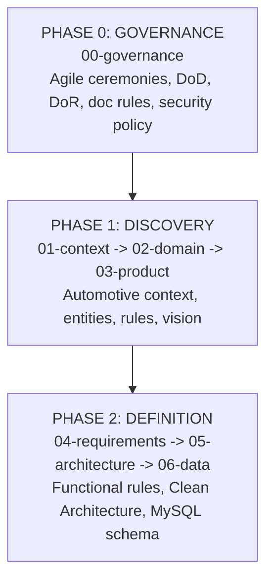

# SDD Guide — Automotive Technical Support Management System

## What is SDD?

**Software Design Documentation (SDD)** is an engineering practice where system
design, domain invariants, and operational workflows are documented and reviewed
**before** implementing production code.

```
Traditional:  Code  ->  Documentation (often obsolete)
SDD:          Documentation  ->  Code  ->  Living Documentation
```

### Core SDD Principles

1. **Design Before Code:** Architectural decisions must be documented and reviewed.
2. **Living Documentation:** Specifications evolve synchronously with code in PRs.
3. **Traceability:** Every user story traces to domain entities, invariants, and tests.

## Lifecycle Phases (00 to 06)

The project design lifecycle is structured across governance, discovery, and definition:



## Structure and Directory Mapping

| Order | Path | Core Automotive Question Answered |
|---|---|---|
| 1 | [`00-governance/`](00-governance/README.md) | How does the engineering team collaborate, review, and enforce standards? |
| 2 | [`01-context/`](01-context/README.md) | What are the boundaries, stakeholders, and ubiquitous automotive terms? |
| 3 | [`02-domain/`](02-domain/README.md) | What are the workshop entities, lifecycle states, and domain invariants? |
| 4 | [`03-product/`](03-product/README.md) | What is the product vision, operational pain points, and MVP roadmap? |
| 5 | [`04-requirements/`](04-requirements/README.md) | What are the functional stories and non-functional engineering metrics? |
| 6 | [`05-architecture/`](05-architecture/README.md) | How is the Go Clean Architecture modular monolith organized? |
| 7 | [`06-data/`](06-data/README.md) | What is the MySQL 8.4 relational schema, tables, and migration strategy? |

## Documentation Enforcement Rules

All documents across folders `00-governance/` to `06-data/` adhere to:
- **Line Count:** Strictly between 25 and 80 lines per markdown document.
- **Instruction Markers:** Zero unpopulated template or instruction tags.
- **Technical Focus:** Concrete specifications tailored to the automotive workshop.\n