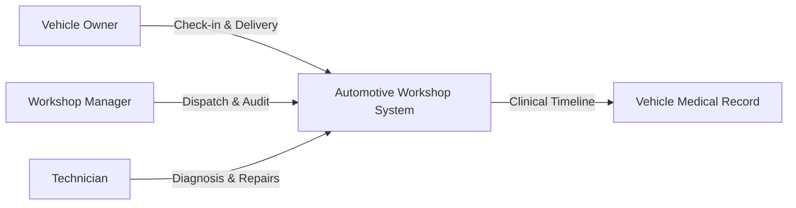

# 01 — System Context

The context section outlines the business environment, operational problem space,
key stakeholders, and system boundaries of the Automotive Technical Support Management System.

## Contents

| Document | Purpose |
|---|---|
| [`glossary.md`](./glossary.md) | Ubiquitous language and domain vocabulary for workshop operations |
| [`overview.md`](./overview.md) | High-level system overview, organizational need, and core solution |
| [`scope.md`](./scope.md) | In-scope capabilities versus deferred corporate ERP integrations |

## Context Summary

The system is a dedicated operational management platform for automotive repair
centers. It bridges the gap between vehicle reception, technical diagnosis,
technician task assignment, intervention logging, warranty tracking, and long-term
clinical vehicle history.

---

**Related:** [`glossary.md`](./glossary.md) · [`overview.md`](./overview.md) · [`scope.md`](./scope.md)\n