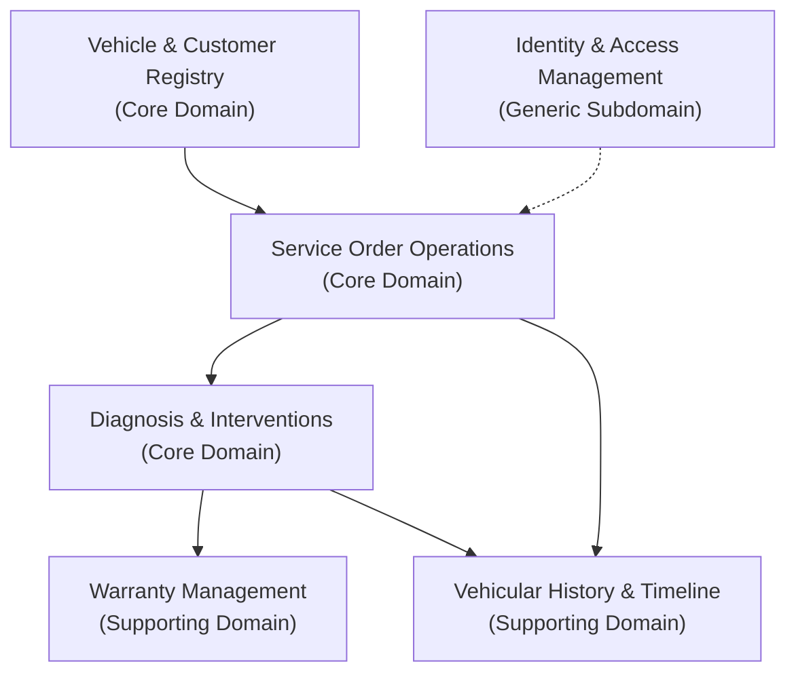

# 02 — Domain Map

The Automotive Workshop domain is partitioned into distinct subdomains, ensuring high
cohesion within business concepts and loose coupling across components.

## Subdomain Decomposition

## Subdomain Descriptions

- **Vehicle & Customer Registry:** Owns master records for customers and vehicles.
- **Service Order Operations:** Manages work tickets and lifecycle state transitions.
- **Diagnosis & Interventions:** Captures technical findings, labor, and spare parts.
- **Warranty Management:** Computes coverage validity based on intervention dates.
- **Vehicular History & Timeline:** Assembles immutable chronological activity records.
- **IAM:** Handles user credentials, password hashing, and role-based authorization.

---

**Related:** [`entities-and-rules.md`](./entities-and-rules.md) · [`module-boundaries.md`](./module-boundaries.md)\n