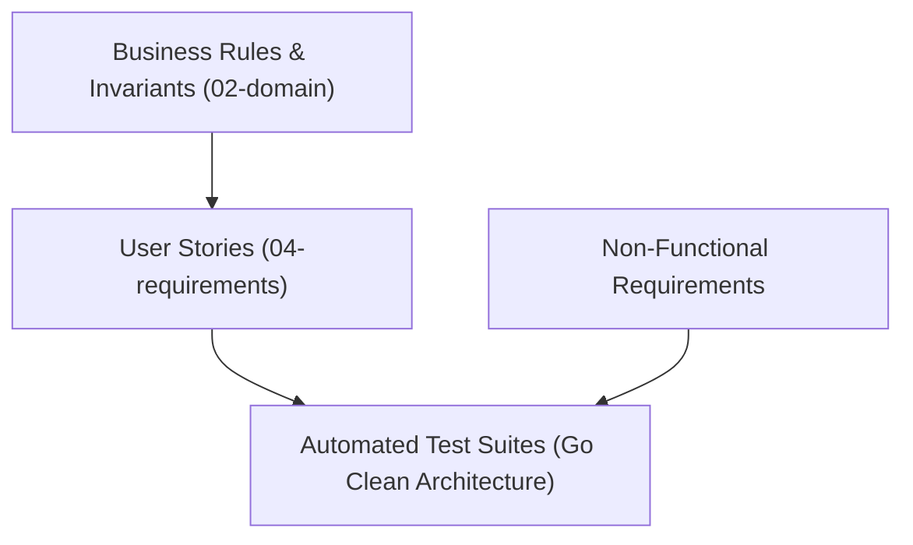

# 04 — Requirements Engineering

The requirements section documents user stories, non-functional performance benchmarks,
and the end-to-end traceability matrix for the Automotive Workshop System.

## Contents

| Document | Purpose |
|---|---|
| [`user-stories.md`](./user-stories.md) | Functional user stories with Gherkin acceptance criteria |
| [`non-functional.md`](./non-functional.md) | Quality attributes: concurrency, latency, security, and persistence |
| [`traceability-matrix.md`](./traceability-matrix.md) | Mapping of user stories to domain entities, invariants, and tests |
| [`_template-hu.md`](./_template-hu.md) | Standard user story template for future requirement engineering |

## Requirements Taxonomy

---

**Related:** [`user-stories.md`](./user-stories.md) · [`non-functional.md`](./non-functional.md)\n