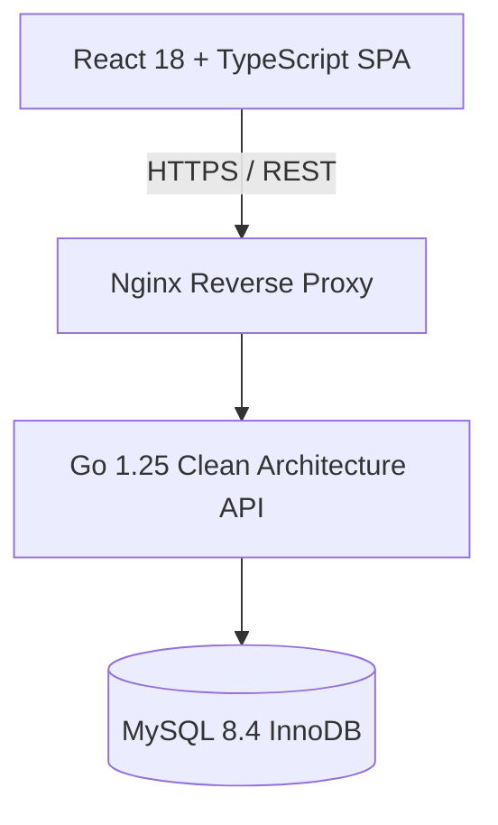

# 05 — Architecture & Design

The architecture section documents the architectural patterns, layering, boundary
enforcement, and Architectural Decision Records (ADRs) of the Automotive Workshop System.

## Contents

| Document | Purpose |
|---|---|
| [`modular-monolith.md`](./modular-monolith.md) | High-level modular monolith design in Go 1.25 |
| [`layered-architecture.md`](./layered-architecture.md) | Clean Architecture layers and dependency inversion |
| [`module-structure.md`](./module-structure.md) | Go package directory layout (`cmd/`, `internal/`) |
| [`boundary-enforcement.md`](./boundary-enforcement.md) | Static rules preventing architectural erosion |
| [`decisions/README.md`](./decisions/README.md) | Index of Architectural Decision Records (ADRs) |

## Architectural Overview

The system is architected as a **Clean Architecture Modular Monolith** in **Go 1.25**:

---

**Related:** [`layered-architecture.md`](./layered-architecture.md) · [`modular-monolith.md`](./modular-monolith.md)\n