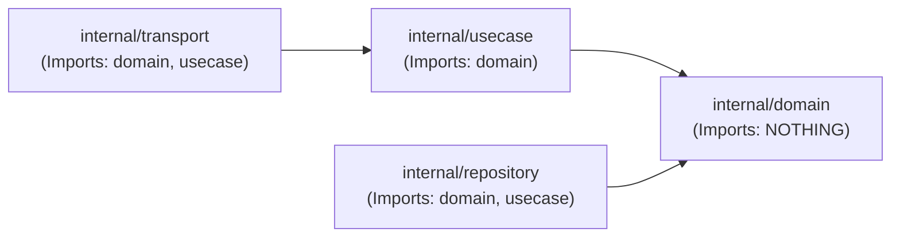

# 05 — Architectural Boundary Enforcement

This document specifies the architectural rules and compiler constraints that prevent
architectural erosion in the Go codebase.

## Static Import Rules

1. **Rule 1 (Pure Domain):** `internal/domain` cannot import `database/sql`, `net/http`,
   or any third-party framework.
2. **Rule 2 (No Reverse Dependencies):** `internal/usecase` never imports `internal/repository`
   or `internal/transport`.
3. **Rule 3 (Interface Separation):** Repositories implement interfaces defined in
   use cases, allowing mock substitutions during unit testing.

## Automated Verification

Boundary compliance is verified via `go vet` and static package dependency analysis
in the continuous integration pipeline.

---

**Related:** [`layered-architecture.md`](./layered-architecture.md) · [`modular-monolith.md`](./modular-monolith.md)\n