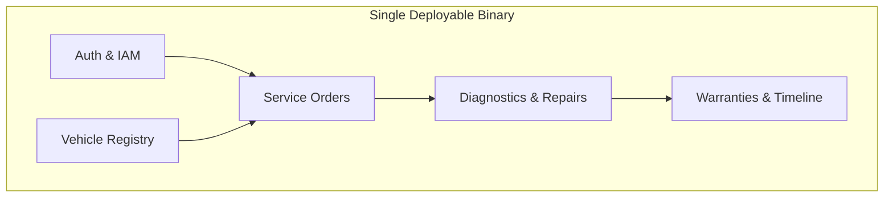

# 05 — Modular Monolith

This document explains why a modular monolith was chosen for the Automotive Workshop System
and how modular boundaries are maintained inside a single deployable artifact.

## Rationale for Modular Monolith

1. **Operational Simplicity:** A single compiled Go binary deployed via Docker simplifies
   monitoring, configuration, and local workshop deployment.
2. **Transactional Guarantees:** MySQL ACID transactions ensure order status mutations and
   mechanic workload checks occur atomically without distributed sagas.
3. **Low Latency:** In-process method calls eliminate network overhead and serialization
   costs between subdomains.

## Modularity Without Microservices

Each module exposes clean Go interfaces, avoiding tight coupling and circular dependencies.

---

**Related:** [`layered-architecture.md`](./layered-architecture.md) · [`decisions/records/ADR-001-go-clean-architecture.md`](./decisions/records/ADR-001-go-clean-architecture.md)\n