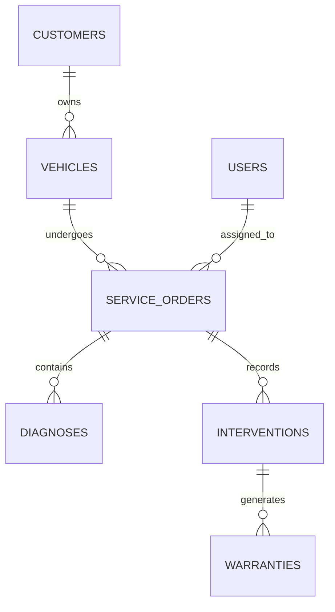

# 06 — Data Architecture

The data architecture section documents database naming conventions, DDL migration
strategies, relational entity models, and initial seed datasets for MySQL 8.4.

## Contents

| Document | Purpose |
|---|---|
| [`database-conventions.md`](./database-conventions.md) | Table, column, index, and constraint naming standards |
| [`models.md`](./models.md) | Physical relational schema, data types, and foreign key relations |
| [`migrations.md`](./migrations.md) | DDL versioning, idempotent execution, and rollback strategies |

## Relational Architecture Overview

Persistence is managed with **MySQL 8.4 InnoDB**, enforcing strict referential integrity.

---

**Related:** [`models.md`](./models.md) · [`database-conventions.md`](./database-conventions.md)\n